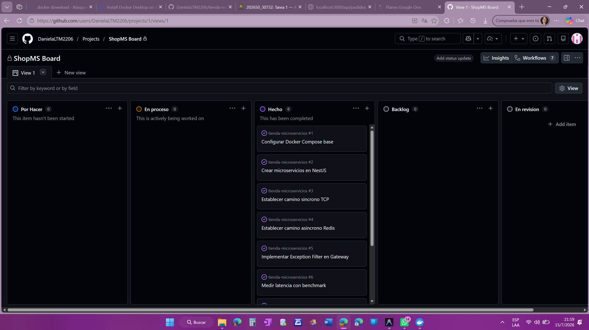
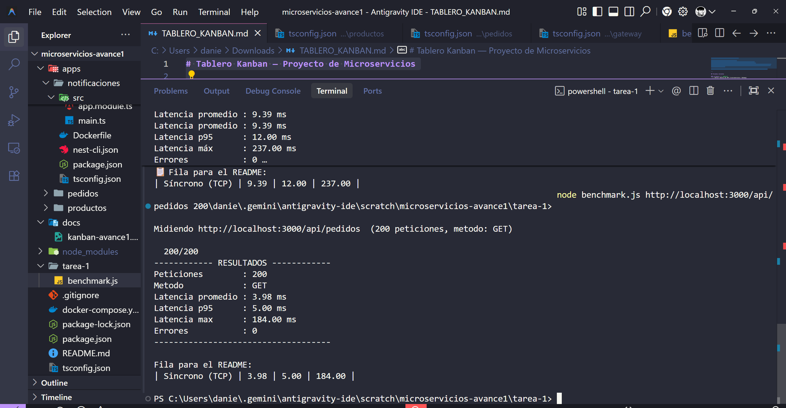
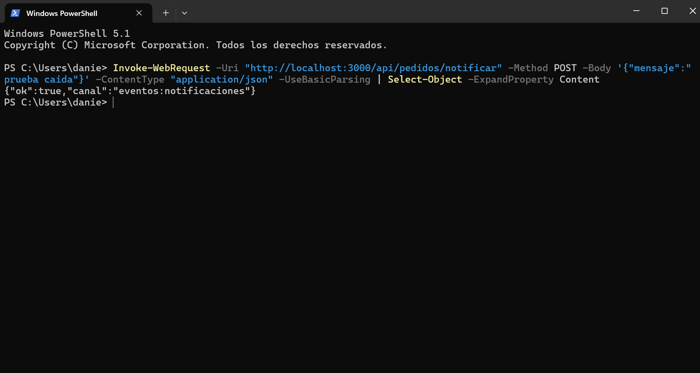

# ShopMS - Sistema de Gestion de Pedidos con Microservicios

> MVP de arquitectura de microservicios - Arquitectura de Software - 7.o semestre - Entrega por avances.

## Equipo

| Integrante | Rol | GitHub |
|---|---|---|
| Daniela Tituaña | Backend / Arquitectura | @DanielaLTM2206 |
| Stiven Molina | Transportes / Comunicacion | @stiven-molina |
| Jeffrey Manobanda | Documentacion / QA | @jeffrey-manobanda |

---

## Descripcion del MVP

ShopMS es un sistema de gestion de pedidos construido con arquitectura de microservicios. El dominio es intencionalmente simple (Pedidos, Productos, Notificaciones) para que el esfuerzo se concentre en la arquitectura de comunicacion y no en la logica de negocio.

El sistema permite crear y consultar pedidos, validar productos y notificar eventos de manera asincrona, demostrando dos modelos de comunicacion contrastantes: sincrono (bloquea, acumula latencia) y asincrono (no bloquea, desacopla en el tiempo).

- **MS 1 - Pedidos (svc-pedidos):** gestiona el ciclo de vida de los pedidos; inicia la cadena sincrona TCP y publica eventos en Redis.
- **MS 2 - Productos (svc-productos):** catalogo de productos; es el segundo salto de la cadena sincrona TCP. Si cae, el flujo sincrono falla.
- **MS 3 - Notificaciones (svc-notificaciones):** suscrito a Redis; procesa eventos de forma completamente desacoplada.
- **API Gateway:** unico punto de entrada HTTP; traduce peticiones REST a mensajes TCP y las enruta al servicio correcto.

## Stack

- **Framework:** NestJS 10 (TypeScript)
- **Sincrono:** TCP (transporte nativo de NestJS) - **Eventos:** Redis PUB/SUB (ioredis) - **2.o transporte:** RabbitMQ (Tarea 2) - **Contrato:** gRPC (Tarea 2)
- **Seguridad:** JWT + Guard (Tarea 3) - **Observabilidad:** Sentry (Tarea 3)
- **BD:** PostgreSQL 16 - **Contenedores:** Docker Compose - **Estructura:** monorepo (npm workspaces)

## Como ejecutar

```bash
# Clonar el repositorio
git clone <url-del-repo>
cd microservicios-avance1

# Levantar todo el sistema (construye y arranca los 4 servicios + BD + Redis)
docker compose up -d --build

# Verificar que todos los servicios estan corriendo
docker compose ps

# Probar el sistema
curl http://localhost:3000/api/health
curl http://localhost:3000/api/pedidos
```

**Rutas disponibles:**

| Metodo | Ruta | Flujo | Descripcion |
|---|---|---|---|
| GET | `/api/health` | Directo | Health check del gateway |
| GET | `/api/pedidos` | Sincrono TCP x2 | Lista pedidos + info de productos |
| POST | `/api/pedidos` | Sincrono TCP x2 | Crear pedido (body: `{"productoId": 1, "cantidad": 2}`) |
| POST | `/api/pedidos/notificar` | Asincrono Redis | Publicar evento (body: `{"mensaje": "hola"}`) |

---

## Arquitectura

### Diagrama - Avance 1

```
+---------------------------------------------------------------------+
|                         CLIENTE (curl / Postman)                     |
+------------------------------+--------------------------------------+
                               | HTTP :3000
                               v
+---------------------------------------------------------------------+
|                    API GATEWAY (gateway:3000)                        |
|  Patron: Proxy - enruta sin logica de negocio                       |
|  Exception Filter global -> errores HTTP coherentes                  |
+--------------------+--------------------+---------------------------+
                     |                    |
        CAMINO A     |                    |  CAMINO B
      SINCRONO TCP   |                    |  ASINCRONO REDIS
                     |                    |
                     v                    v
+----------------------------+    +----------------------------+
|  svc-pedidos (TCP :3001)   |    |  svc-pedidos (TCP :3001)   |
|  MS A - Inicia cadena      |    |  MS A - Publica evento     |
+-----------+----------------+    +--------------+-------------+
            |                                    |
            | TCP (2o salto)                     | Redis PUBLISH
            | Latencia Acumulada                 | No Bloquea
            v                                    v
+----------------------------+    +----------------------------+
| svc-productos (TCP :3002)  |    |    Redis (canal eventos)   |
|  MS B - Catálogo productos |    +--------------+-------------+
|  Si cae -> TODO falla      |                   | SUBSCRIBE
+----------------------------+                   v
                                  +----------------------------+
                                  |  svc-notificaciones        |
                                  |  MS C - Consumidor eventos |
                                  |  Si cae -> flujo continua  |
                                  +----------------------------+

Infraestructura compartida:
  PostgreSQL <- svc-pedidos, svc-productos (cada uno su propio schema/tabla)
  Redis      <- svc-pedidos (PUBLISH), svc-notificaciones (SUBSCRIBE)
```

---

## Metodologia

- **Kanban:** [GitHub Projects - ShopMS Board](https://github.com/users/DanielaLTM2206/projects/1/views/1)
  
  
  
- **Ramificacion:** GitHub Flow - main protegida, ramas `feat/...`, `fix/...`, `docs/...`, PRs revisados por otro integrante, tags por avance.
- **Commits semanticos:** Conventional Commits.

**Ejemplos de commits:**
```
feat(gateway): agregar rutas HTTP y cliente TCP hacia svc-pedidos
feat(pedidos): implementar cadena sincrona TCP con svc-productos
feat(notificaciones): suscribir a canal Redis eventos:notificaciones
fix(pedidos): controlar timeout de svc-productos con catchError
docs(readme): agregar diagrama de arquitectura avance 1
chore(docker): configurar health checks en docker-compose
```

**Estrategia de ramificacion:**
```
main <- feat/gateway-setup (PR)
     <- feat/ms-pedidos     (PR)
     <- feat/ms-productos   (PR)
     <- feat/ms-notificaciones (PR)
     <- docs/readme-avance1  (PR)
     <- tag v1-avance1
```

---

## Patrones y principios SOLID aplicados

| Patron / Principio | Donde se aplica | Descripcion |
|---|---|---|
| **API Gateway** | `apps/gateway` | Punto unico de entrada; oculta la topologia interna |
| **Proxy** | `gateway/pedidos.controller.ts` | Delega peticiones sin logica de negocio |
| **Publisher/Subscriber** | `pedidos.service.ts` + `notificaciones.service.ts` | Redis PUB/SUB desacopla emisor y consumidor |
| **Exception Filter** | `gateway/filters/all-exceptions.filter.ts` | Captura todos los errores y devuelve HTTP coherente |
| **SRP** (Single Responsibility) | Todos los modulos | Cada clase tiene UNA razon para cambiar |
| **DIP** (Dependency Inversion) | Todos los servicios | Dependen de abstracciones (ClientProxy, Repository), no de clases concretas |
| **OCP** (Open/Closed) | `notificaciones.service.ts` | Agregar tipos de evento = agregar un `case`, sin modificar lo existente |

**Que trae NestJS:** decoradores `@Module`, `@Injectable`, `@MessagePattern`, `ClientsModule`, `Transport.TCP`, inyeccion de dependencias, `Repository` de TypeORM.  
**Que agregamos nosotros:** `AllExceptionsFilter` global, `timeout()` + `catchError()` en cadenas RxJS, publicador/suscriptor Redis con `ioredis`, seed de datos en `onModuleInit`.

---

## Avance 1 - Acoplamiento temporal y latencia - `tag v1-avance1`

### Caminos implementados

- **Sincrono (TCP):** Gateway -> svc-pedidos (TCP) -> svc-productos (TCP) -> respuesta acumulada.
- **Asincrono (Redis):** Gateway -> svc-pedidos (TCP) -> Redis PUBLISH -> svc-notificaciones SUBSCRIBE (el emisor no espera).

### Latencia medida con `benchmark.js`

| Camino | Promedio (ms) | p95 (ms) | Max (ms) |
|---|---|---|---|
| Sincrono (TCP x2) | 3.98 | 5.00 | 184.00 |
| Asincrono (Redis PUBLISH) | 2.21 | 3.00 | 57.00 |

**Capturas de los benchmarks de latencia:**
* Sincrono (TCP):


* Asincrono (Redis):


**Como reproducir:**
```bash
# Sincrono (GET /api/pedidos - 2 saltos TCP)
node tarea-1/benchmark.js http://localhost:3000/api/pedidos 200

# Asincrono (POST /api/pedidos/notificar - publica en Redis)
node tarea-1/benchmark.js http://localhost:3000/api/pedidos/notificar 200 --post
```

### Prueba de acoplamiento temporal

**Paso 1 - Apagar svc-productos (segundo salto de la cadena sincrona):**
```bash
docker compose stop svc-productos
```

**Paso 2 - Probar camino sincrono (debe fallar):**
```bash
curl http://localhost:3000/api/pedidos
# Resultado esperado: 503 Service Unavailable
# "svc-pedidos no responde - acoplamiento temporal demostrado"
```

**Paso 3 - Probar camino asincrono (debe seguir funcionando):**
```bash
curl -X POST http://localhost:3000/api/pedidos/notificar \
  -H "Content-Type: application/json" \
  -d '{"mensaje": "prueba con svc-productos caido"}'
# Resultado esperado: 201 OK - el evento se publica SIN importar que svc-productos este caido
```

**Evidencia de la prueba de caida:**

1. Apagado del servicio `svc-productos`:


2. Intento de peticion sincrona (GET /api/pedidos) fallido con error 503:


3. Intento de peticion asincrona (POST /api/pedidos/notificar) exitoso:



### Analisis

**Acumulacion de latencia (camino sincrono):**  
En una cadena sincrona Gateway -> A -> B, el tiempo total de respuesta es la suma de las latencias de cada salto: `t_total ≈ t_gateway + t_pedidos + t_productos`. Cada servicio debe esperar que el anterior responda antes de continuar. Si cada salto demora ~10 ms, la cadena acumula ~30 ms solo en transporte, sin contar el tiempo de BD.

**Acoplamiento temporal:**  
El modelo sincrono exige que todos los servicios de la cadena esten vivos al mismo tiempo. Al apagar `svc-productos`, la peticion a `GET /api/pedidos` falla completamente con un error 503, aunque `svc-pedidos` y el Gateway esten funcionando perfectamente. Esto es el acoplamiento temporal: si uno falla, falla toda la cadena.

En contraste, el modelo asincrono (Redis PUB/SUB) desacopla en el tiempo: `svc-pedidos` publica el evento y retorna inmediatamente al cliente, sin saber si `svc-notificaciones` esta vivo o no. El consumidor puede levantarse mas tarde y procesara los nuevos eventos. Los dos servicios no necesitan coincidir en el tiempo.

---

## Avance 2 - Comunicacion: gRPC + RabbitMQ + Excepciones - `tag v2-avance2`

### Diagrama - Avance 2 (4 transportes)

```
+-------------------------------------------------------------------+
|                    CLIENTE (curl / Postman)                        |
+-------------------------------------------------------------------+
                               | HTTP :3000
                               v
+-------------------------------------------------------------------+
|                API GATEWAY (gateway:3000)                          |
|  Patron: Proxy - enruta sin logica de negocio                     |
|  AllExceptionsFilter global -> errores HTTP coherentes             |
+----------+----------+--------------------+-----------------------+
           |          |                    |                       |
  CAMINO A |          | CAMINO B           | CAMINO C              | CAMINO D
  TCP sync |          | Redis PUBLISH      | TCP -> gRPC           | TCP -> RabbitMQ
           v          v                    v                       v
+------------------+  +----------------+  +--------------------+  +------------+
| svc-pedidos      |  | svc-pedidos    |  | svc-pedidos        |  | svc-pedidos|
| TCP :3001        |  | TCP :3001      |  | TCP :3001          |  | TCP :3001  |
+--------+---------+  +-------+--------+  +------+-------------+  +-----+------+
         |                    |                  |                       |
    TCP  |            Redis   |          gRPC    |             RabbitMQ |
    2o   |            PUBLISH |          :5000   |             PUBLISH  |
   salto |                    |                  |             stock_   |
         v                    v                  v             actualizar
+------------------+  +-------+--------+  +------------------+       |
| svc-productos    |  |  Redis (canal) |  | svc-productos    |       v
| TCP :3002        |  +-------+--------+  | gRPC :5000       |  +----+--------+
| MS B (catalogo)  |          | SUBSCRIBE | MS B (catalogo)  |  | RabbitMQ   |
+------------------+          v           +------------------+  +-----+-------+
                     +--------+---------+                             | CONSUME
                     | svc-notificaciones|                            v
                     | MS C - consumidor |              +-------------+-------+
                     | Redis PUB/SUB     |              | svc-notificaciones  |
                     +-------------------+              | RabbitMQ consumer   |
                                                        +--------------------+

Infraestructura Avance 2:
  PostgreSQL <- svc-pedidos, svc-productos
  Redis      <- svc-pedidos (PUBLISH), svc-notificaciones (SUBSCRIBE) [Avance 1]
  RabbitMQ   <- svc-pedidos (PUBLISH), svc-notificaciones (CONSUME)  [Avance 2]
  gRPC       <- svc-pedidos (cliente), svc-productos (servidor)      [Avance 2]
```

---

### Contrato gRPC — `apps/proto/productos.proto`

El contrato es el archivo central del patron Contract-First. Vive en una carpeta compartida
del monorepo (`apps/proto/`) y es referenciado por ambos servicios en tiempo de build.

```proto
syntax = "proto3";
package productos;

service ProductosService {
  rpc ObtenerProducto (ProductoRequest) returns (ProductoResponse);
  rpc ListarProductos  (ListarRequest)   returns (ListarResponse);
}

message ProductoRequest  { int32 id = 1; }

message ProductoResponse {
  int32  id         = 1;
  string nombre     = 2;
  double precio     = 3;
  bool   disponible = 4;
  bool   encontrado = 5;  // false = error controlado (producto no existe)
  string error      = 6;  // descripcion del error si encontrado=false
}

message ListarRequest {}
message ListarResponse { repeated ProductoResponse productos = 1; }
```

**Como funciona la comunicacion gRPC:**

1. `svc-productos` levanta un servidor gRPC en el puerto `5000` junto con su servidor TCP `3002`.
   NestJS soporta multiples transportes con `app.connectMicroservice()`.
2. `svc-pedidos` crea un stub gRPC en `onModuleInit()` usando `ClientGrpc.getService()`.
3. Cuando el Gateway llama `GET /api/pedidos/producto/:id/grpc`, la cadena es:
   `Gateway (HTTP) → svc-pedidos (TCP) → svc-productos (gRPC)`.
4. Si el producto no existe, `svc-productos` retorna `encontrado=false` con un mensaje de error.
   El servicio **no cae** — es un error controlado con try/catch en la capa de servicios.

**Rutas de prueba gRPC:**
```bash
# Producto existente -> respuesta exitosa con datos del producto
curl http://localhost:3000/api/pedidos/producto/1/grpc

# Producto inexistente -> error CONTROLADO (200 OK con ok:false, servicio sigue vivo)
curl http://localhost:3000/api/pedidos/producto/999/grpc
```

---

### Segundo Transporte — RabbitMQ (cola `stock_actualizar`)

**Por que RabbitMQ y no Redis para este flujo:**
Redis PUB/SUB es volatile — si el consumidor esta caido en el momento del PUBLISH,
el mensaje se pierde. RabbitMQ usa colas durables: el mensaje persiste hasta que
el consumidor lo procesa, lo que garantiza entrega incluso con reinicios del servicio.

**Flujo PUB/SUB con RabbitMQ:**

```
POST /api/pedidos
    └─► svc-pedidos.create()
         ├─► [TCP]      svc-productos: verificar producto existe
         ├─► BD local:  guardar pedido
         ├─► [Redis]    PUBLISH eventos:notificaciones (Avance 1 - se conserva)
         └─► [RabbitMQ] emit('stock.actualizar', payload)
                              └─► cola: stock_actualizar (durable)
                                   └─► svc-notificaciones.handleStockActualizar()
                                        └─► procesarStockUpdate(): log de actualizacion
```

**Probar el flujo RabbitMQ:**
```bash
# 1. Crear un pedido (dispara automaticamente Redis + RabbitMQ)
curl -X POST http://localhost:3000/api/pedidos \
  -H "Content-Type: application/json" \
  -d '{"productoId": 1, "cantidad": 3}'

# 2. Publicar en RabbitMQ manualmente (para prueba aislada)
curl -X POST http://localhost:3000/api/pedidos/stock \
  -H "Content-Type: application/json" \
  -d '{"productoId":2,"productoNombre":"Mouse","cantidadVendida":5,"pedidoId":99}'

# 3. Ver panel de administracion RabbitMQ
open http://localhost:15672  # usuario: guest / password: guest
```

**Evidencia en logs de svc-notificaciones:**
```
🐇 [RabbitMQ] Evento recibido: stock.actualizar
🐇 [RabbitMQ] Procesando stock.actualizar:
   Producto: #1 "Laptop Pro"
   Cantidad vendida: 3
   Pedido relacionado: #7
   Timestamp: 2026-07-18T01:30:00.000Z
✅ [RabbitMQ] Stock del producto "Laptop Pro" actualizado: -3 unidades
```

---

### Manejo de Excepciones

**Estrategia consistente en todos los caminos (C3 rubrica — nivel 5):**

| Capa | Mecanismo | Efecto |
|---|---|---|
| Gateway (HTTP) | `AllExceptionsFilter` global | Convierte cualquier error en HTTP coherente (4xx/5xx) |
| svc-pedidos (TCP) | `AllRpcExceptionsFilter` global | Errores en handlers TCP retornan objeto estructurado, no tumban |
| svc-pedidos (Service) | `try/catch` en cada metodo | Errores de infraestructura (Redis/RabbitMQ caidos) no fallan el flujo principal |
| svc-productos (gRPC) | `try/catch` en `@GrpcMethod` | Retorna `encontrado=false` en lugar de lanzar excepcion gRPC |
| svc-notificaciones (RabbitMQ) | `try/catch` en `@EventPattern` | Mensaje malformado no tumba el consumidor |

**Demo de error controlado — producto inexistente por gRPC:**
```bash
# Llamar con id=999 (no existe en la BD)
curl http://localhost:3000/api/pedidos/producto/999/grpc

# Respuesta esperada (200 OK - el servicio NO cae):
{
  "ok": false,
  "transporte": "gRPC",
  "error": "Producto con id=999 no existe en el catalogo"
}

# Log en svc-productos:
⚠️  [gRPC] Producto id=999 no encontrado (error controlado)

# Log en svc-pedidos:
[gRPC] ⚠️  Error controlado: Producto con id=999 no existe en el catalogo
```

---

### Como ejecutar el sistema completo (Avance 2)

```bash
# Levantar con el docker-compose del Avance 2
docker compose -f docker-compose.transportes.yml up -d --build

# Verificar que todos los servicios estan corriendo
docker compose -f docker-compose.transportes.yml ps

# Ver logs en tiempo real
docker compose -f docker-compose.transportes.yml logs -f svc-notificaciones
```

**Rutas disponibles Avance 2:**

| Metodo | Ruta | Transporte | Descripcion |
|---|---|---|---|
| GET | `/api/health` | HTTP directo | Health check del gateway |
| GET | `/api/pedidos` | TCP x2 | Lista pedidos + info de productos |
| POST | `/api/pedidos` | TCP x2 + Redis + RabbitMQ | Crear pedido (dispara 4 transportes) |
| POST | `/api/pedidos/notificar` | TCP + Redis | Publicar evento Redis manual |
| GET | `/api/pedidos/producto/:id/grpc` | TCP + gRPC | **[NUEVO]** Consultar producto por gRPC |
| POST | `/api/pedidos/stock` | TCP + RabbitMQ | **[NUEVO]** Publicar en RabbitMQ manual |

---

### Tabla comparativa de transportes

| Transporte | Tipo | Patron | Garantia de entrega | Cuando lo usamos |
|---|---|---|---|---|
| **TCP** | Sincrono | Peticion-respuesta | Alta (bloquea hasta respuesta) | Cadena Gateway → svc-pedidos → svc-productos |
| **Redis PUB/SUB** | Asincrono | Publicar/Suscribir | Sin garantia (volatile) | Notificaciones de pedido creado (Avance 1) |
| **RabbitMQ** | Asincrono | Cola de mensajes | Alta (cola durable, persiste) | Actualizacion de stock — no se puede perder (Avance 2) |
| **gRPC** | Sincrono | Contrato RPC | Alta (bloquea, con timeout) | Cuando se necesita contrato tipado entre servicios (Avance 2) |

**Cuando conviene cada transporte segun lo observado:**
- **TCP NestJS:** ideal como transporte base dentro del mismo ecosistema NestJS. Simple y rapido, pero sin contrato formal.
- **Redis PUB/SUB:** cuando la velocidad es critica y se puede tolerar perder eventos si el consumidor esta caido (notificaciones opcionales, logs).
- **RabbitMQ:** cuando la entrega DEBE garantizarse aunque el consumidor este temporalmente caido (actualizaciones criticas de stock, facturacion, etc.). La cola durable persiste los mensajes.
- **gRPC:** cuando se necesita un contrato fuerte entre servicios (el `.proto` define exactamente los tipos), comunicacion eficiente en binario (Protocol Buffers), y es posible que el servicio destino cambie de equipo o lenguaje.

---

### Patrones y principios SOLID nuevos en Avance 2

| Patron / Principio | Donde se aplica | Descripcion |
|---|---|---|
| **Contract-First (gRPC)** | `apps/proto/productos.proto` | El contrato define la interfaz ANTES de implementar |
| **Hybrid Application** | `svc-productos/main.ts` | Un servicio con multiples transportes (TCP + gRPC) simultaneos |
| **AllRpcExceptionsFilter** | `svc-pedidos/filters/` | Estrategia centralizada de errores para handlers TCP |
| **OCP** (Open/Closed) | `notificaciones.service.ts` | Se agrego `procesarStockUpdate` sin modificar el codigo Redis existente |
| **ISP** (Interface Segregation) | `ProductosGrpcService` interface | La interfaz del stub gRPC declara solo los metodos que pedidos necesita |

---

### Evidencias de Funcionamiento (Pruebas)

A continuación se detallan las respuestas y logs reales obtenidos al ejecutar las pruebas en el entorno de desarrollo:

#### 1. Evidencia de gRPC Funcionando (Caso Exitoso)
Petición HTTP al Gateway que dispara una consulta interna síncrona gRPC a `svc-productos`:
```bash
curl http://localhost:3000/api/pedidos/producto/1/grpc
```
**Respuesta JSON obtenida (200 OK):**
```json
{
  "ok": true,
  "transporte": "gRPC",
  "producto": {
    "id": 1,
    "nombre": "Laptop Pro",
    "precio": 1299.99,
    "disponible": true,
    "encontrado": true,
    "error": ""
  }
}
```

#### 2. Evidencia de Manejo de Excepciones gRPC (Caso Controlado sin Caída)
Petición de un producto que no existe en el catálogo para demostrar que no se cae el servicio:
```bash
curl http://localhost:3000/api/pedidos/producto/999/grpc
```
**Respuesta JSON obtenida (200 OK - Controlado):**
```json
{
  "ok": false,
  "transporte": "gRPC",
  "error": "Producto con id=999 no existe en el catalogo"
}
```
**Log en `svc-productos` (ms-productos):**
```text
⚠️  [gRPC] Producto id=999 no encontrado (error controlado)
```

#### 3. Evidencia del Segundo Transporte RabbitMQ (Mensaje Publicado y Consumido)
Petición POST para simular actualización de stock asíncrona:
```bash
curl -X POST http://localhost:3000/api/pedidos/stock \
  -H "Content-Type: application/json" \
  -d '{"productoId":2,"productoNombre":"Mouse Inalambrico","cantidadVendida":5,"pedidoId":101}'
```
**Logs de consumo en `svc-notificaciones` (ms-notificaciones):**
```text
ms-notificaciones  | [Nest] 1  - 07/18/2026, 3:47:00 AM     LOG [NotificacionesController] 🐇 [RabbitMQ] Evento recibido: stock.actualizar
ms-notificaciones  | [Nest] 1  - 07/18/2026, 3:47:00 AM     LOG [NotificacionesService] 🐇 [RabbitMQ] Procesando stock.actualizar:
ms-notificaciones  | [Nest] 1  - 07/18/2026, 3:47:00 AM     LOG [NotificacionesService]    Producto: #2 "Mouse Inalambrico"
ms-notificaciones  | [Nest] 1  - 07/18/2026, 3:47:00 AM     LOG [NotificacionesService]    Cantidad vendida: 5
ms-notificaciones  | [Nest] 1  - 07/18/2026, 3:47:00 AM     LOG [NotificacionesService]    Pedido relacionado: #101
ms-notificaciones  | [Nest] 1  - 07/18/2026, 3:47:00 AM     LOG [NotificacionesService]    Timestamp: 2026-07-18T03:47:00.044Z
ms-notificaciones  | [Nest] 1  - 07/18/2026, 3:47:00 AM     LOG [NotificacionesService] ✅ [RabbitMQ] Stock del producto "Mouse Inalambrico" actualizado: -5 unidades
```

---

## Avance 3 - Seguridad, observabilidad e integracion (FINAL) - `tag v3-final`

> *Pendiente - Tarea 3*

---

## Tags de entrega

- `v1-avance1` - Avance 1 completado - `v2-avance2` - Avance 2 completado - `v3-final` - *pendiente*
