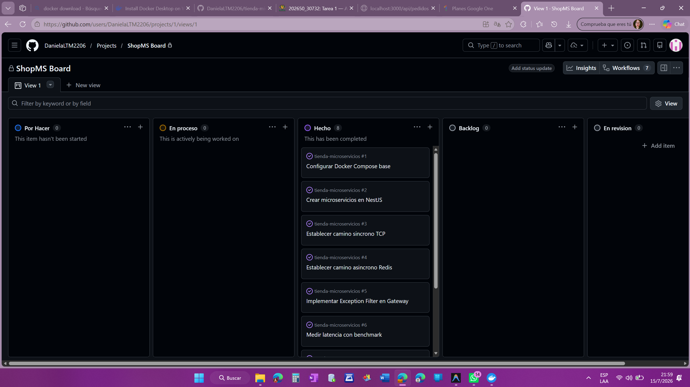
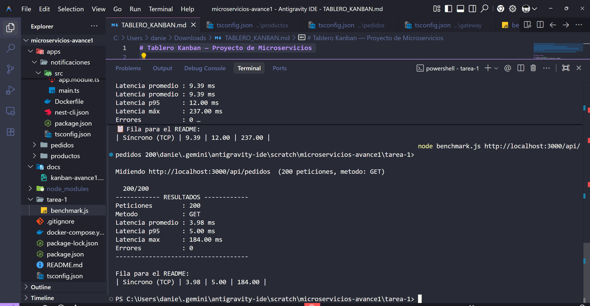
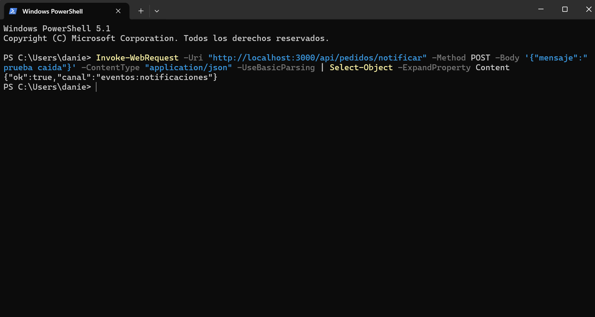

# ShopMS - Sistema de Gestion de Pedidos con Microservicios

> MVP de arquitectura de microservicios - Arquitectura de Software - 7.o semestre - Entrega por avances.

## Equipo

| Integrante | Rol | GitHub |
|---|---|---|
| Daniela Tituaña | Backend / Arquitectura | @DanielaLTM2206 |
| Stiven Molina | Transportes / Comunicacion | @gsMolina02 |
| Jeffrey Manobanda | Documentacion / QA | @jeffrey2206 |

---

## Descripcion del MVP

ShopMS es un sistema de gestion de pedidos construido con arquitectura de microservicios. El dominio es intencionalmente simple (Pedidos, Productos, Notificaciones) para que el esfuerzo se concentre en la arquitectura de comunicacion y no en la logica de negocio.

El sistema permite crear y consultar pedidos, validar productos y notificar eventos de manera asincrona, demostrando dos modelos de comunicacion contrastantes: sincrono (bloquea, acumula latencia) y asincrono (no bloquea, desacopla en el tiempo).

- **MS 1 - Pedidos (svc-pedidos):** gestiona el ciclo de vida de los pedidos; inicia la cadena sincrona TCP y publica eventos en Redis.
- **MS 2 - Productos (svc-productos):** catalogo de productos; es el segundo salto de la cadena sincrona TCP. Si cae, el flujo sincrono falla.
- **MS 3 - Notificaciones (svc-notificaciones):** suscrito a Redis; procesa eventos de forma completamente desacoplada.
- **API Gateway:** unico punto de entrada HTTP; traduce peticiones REST a mensajes TCP y las enruta al servicio correcto.

## Stack

- **Framework:** NestJS 10 (TypeScript)
- **Sincrono:** TCP (transporte nativo de NestJS) - **Eventos:** Redis PUB/SUB (ioredis) - **2.o transporte:** RabbitMQ (Tarea 2) - **Contrato:** gRPC (Tarea 2)
- **Seguridad:** JWT + Guard (Tarea 3) - **Observabilidad:** Sentry (Tarea 3)
- **BD:** PostgreSQL 16 - **Contenedores:** Docker Compose - **Estructura:** monorepo (npm workspaces)

## Como ejecutar

```bash
# Clonar el repositorio
git clone <url-del-repo>
cd microservicios-avance1

# Levantar todo el sistema (construye y arranca los 4 servicios + BD + Redis)
docker compose up -d --build

# Verificar que todos los servicios estan corriendo
docker compose ps

# Probar el sistema
curl http://localhost:3000/api/health
curl http://localhost:3000/api/pedidos
```

**Rutas disponibles:**

| Metodo | Ruta | Flujo | Descripcion |
|---|---|---|---|
| GET | `/api/health` | Directo | Health check del gateway |
| GET | `/api/pedidos/ping` | Sincrono TCP x1 | Un solo salto (gateway -> pedidos), para medir latencia por salto |
| GET | `/api/pedidos` | Sincrono TCP x2 | Lista pedidos + info de productos |
| POST | `/api/pedidos` | Sincrono TCP x2 | Crear pedido (body: `{"productoId": 1, "cantidad": 2}`) |
| POST | `/api/pedidos/notificar` | Asincrono Redis | Publicar evento (body: `{"mensaje": "hola"}`) |

---

## Arquitectura

### Diagrama - Avance 1

```
+---------------------------------------------------------------------+
|                         CLIENTE (curl / Postman)                     |
+------------------------------+--------------------------------------+
                               | HTTP :3000
                               v
+---------------------------------------------------------------------+
|                    API GATEWAY (gateway:3000)                        |
|  Patron: Proxy - enruta sin logica de negocio                       |
|  Exception Filter global -> errores HTTP coherentes                  |
+--------------------+--------------------+---------------------------+
                     |                    |
        CAMINO A     |                    |  CAMINO B
      SINCRONO TCP   |                    |  ASINCRONO REDIS
                     |                    |
                     v                    v
+----------------------------+    +----------------------------+
|  svc-pedidos (TCP :3001)   |    |  svc-pedidos (TCP :3001)   |
|  MS A - Inicia cadena      |    |  MS A - Publica evento     |
+-----------+----------------+    +--------------+-------------+
            |                                    |
            | TCP (2o salto)                     | Redis PUBLISH
            | Latencia Acumulada                 | No Bloquea
            v                                    v
+----------------------------+    +----------------------------+
| svc-productos (TCP :3002)  |    |    Redis (canal eventos)   |
|  MS B - Catálogo productos |    +--------------+-------------+
|  Si cae -> TODO falla      |                   | SUBSCRIBE
+----------------------------+                   v
                                  +----------------------------+
                                  |  svc-notificaciones        |
                                  |  MS C - Consumidor eventos |
                                  |  Si cae -> flujo continua  |
                                  +----------------------------+

Infraestructura compartida:
  PostgreSQL <- svc-pedidos (BD pedidos_db), svc-productos (BD productos_db)
               (una base de datos por microservicio - ver scripts/init-db.sql)
  Redis      <- svc-pedidos (PUBLISH), svc-notificaciones (SUBSCRIBE)
```

---

## Metodologia

- **Kanban:** [GitHub Projects - ShopMS Board](https://github.com/users/DanielaLTM2206/projects/1/views/1) *(board en proceso de hacerse publico; cada tarjeta se vincula a su issue/PR)*
  
  
  
- **Commits semanticos:** Conventional Commits.
- **Tags por avance:** `v1-avance1`, `v2-avance2`, `v3-final`.

**Transparencia sobre el proceso (Avances 1 y 2):** el codigo de los dos primeros
avances se subio a `main` en commits unicos y grandes; las ramas `feat/...` y
`docs/...` se crearon pero no recibieron commits propios ni hubo PRs mergeados.
La version anterior de esta seccion describia un GitHub Flow con PRs revisados
que en realidad no ocurrio; se corrige aqui para que la documentacion refleje
el historial real del repositorio.

**Flujo de trabajo adoptado a partir de la retroalimentacion (en adelante):**
- Una rama por tarea (`feat/...`, `fix/...`, `docs/...`) con commits incrementales y pequenos.
- PRs reales mergeados a `main`, revisados por un integrante distinto al autor.
- Commits de los tres integrantes, cada uno con su propia identidad de Git.
- Tarjetas del Kanban vinculadas a su issue/PR correspondiente.

---

## Patrones y principios SOLID aplicados

| Patron / Principio | Donde se aplica | Descripcion |
|---|---|---|
| **API Gateway** | `apps/gateway` | Punto unico de entrada; oculta la topologia interna |
| **Proxy** | `gateway/pedidos.controller.ts` | Delega peticiones sin logica de negocio |
| **Publisher/Subscriber** | `pedidos.service.ts` + `notificaciones.service.ts` | Redis PUB/SUB desacopla emisor y consumidor |
| **Exception Filter** | `gateway/filters/all-exceptions.filter.ts` | Captura todos los errores y devuelve HTTP coherente |
| **SRP** (Single Responsibility) | Todos los modulos | Cada clase tiene UNA razon para cambiar |
| **DIP** (Dependency Inversion) | Todos los servicios | Dependen de abstracciones (ClientProxy, Repository), no de clases concretas |
| **OCP** (Open/Closed) | `notificaciones.service.ts` | Agregar tipos de evento = agregar un `case`, sin modificar lo existente |

**Que trae NestJS:** decoradores `@Module`, `@Injectable`, `@MessagePattern`, `ClientsModule`, `Transport.TCP`, inyeccion de dependencias, `Repository` de TypeORM.  
**Que agregamos nosotros:** `AllExceptionsFilter` global, `timeout()` + `catchError()` en cadenas RxJS, publicador/suscriptor Redis con `ioredis`, seed de datos en `onModuleInit`.

---

## Avance 1 - Acoplamiento temporal y latencia - `tag v1-avance1`

### Caminos implementados

- **Sincrono (TCP):** Gateway -> svc-pedidos (TCP) -> svc-productos (TCP) -> respuesta acumulada.
- **Asincrono (Redis):** Gateway -> svc-pedidos (TCP) -> Redis PUBLISH -> svc-notificaciones SUBSCRIBE (el emisor no espera).

### Latencia medida con `benchmark.js`

Medicion original del Avance 1 (respaldada por las capturas de abajo):

| Camino | Promedio (ms) | p95 (ms) | Max (ms) |
|---|---|---|---|
| Sincrono (TCP x2) | 3.98 | 5.00 | 184.00 |
| Asincrono (Redis PUBLISH) | 2.21 | 3.00 | 57.00 |

**Descomposicion por salto** (re-medicion del 2026-07-20, mismo run, 200 peticiones por camino, 0 errores):

| Camino | Promedio (ms) | p95 (ms) | Max (ms) |
|---|---|---|---|
| Sincrono 1 salto (`/api/pedidos/ping`, TCP x1, sin BD) | 2.71 | 3.00 | 120.00 |
| Sincrono 2 saltos (`/api/pedidos`, TCP x2 + BD) | 4.86 | 6.00 | 83.00 |
| Asincrono (`/api/pedidos/notificar`, TCP x1 + Redis PUBLISH) | 3.12 | 4.00 | 62.00 |

La resta entre los dos caminos sincronos **mide** (ya no solo afirma) lo que agrega
el segundo salto: `4.86 − 2.71 ≈ 2.15 ms` por el salto TCP extra mas la consulta a BD.
Cada salto adicional en una cadena sincrona suma su propia latencia y no puede
empezar hasta que termina el anterior.

> Nota de honestidad metodologica: el endpoint "asincrono" tambien atraviesa un
> salto TCP sincrono (gateway -> svc-pedidos) antes de publicar en Redis, asi que
> su latencia no es de publicacion pura. Comparado contra el camino de 1 salto
> (2.71 ms), el PUBLISH a Redis agrega apenas ~0.4 ms porque el emisor no espera
> al consumidor.

**Capturas de los benchmarks de latencia:**
* Sincrono (TCP):


* Asincrono (Redis):


**Como reproducir:**
```bash
# Sincrono 1 salto (GET /api/pedidos/ping - solo gateway -> svc-pedidos)
node tarea-1/benchmark.js http://localhost:3000/api/pedidos/ping 200

# Sincrono 2 saltos (GET /api/pedidos - gateway -> pedidos -> productos + BD)
node tarea-1/benchmark.js http://localhost:3000/api/pedidos 200

# Asincrono (POST /api/pedidos/notificar - publica en Redis)
node tarea-1/benchmark.js http://localhost:3000/api/pedidos/notificar 200 --post
```

### Prueba de acoplamiento temporal

**Paso 1 - Apagar svc-productos (segundo salto de la cadena sincrona):**
```bash
docker compose stop svc-productos
```

**Paso 2 - Probar camino sincrono (debe fallar):**
```bash
curl http://localhost:3000/api/pedidos
# Resultado esperado: 503 Service Unavailable
# "svc-pedidos no responde - acoplamiento temporal demostrado"
```

**Paso 3 - Probar camino asincrono (debe seguir funcionando):**
```bash
curl -X POST http://localhost:3000/api/pedidos/notificar \
  -H "Content-Type: application/json" \
  -d '{"mensaje": "prueba con svc-productos caido"}'
# Resultado esperado: 201 OK - el evento se publica SIN importar que svc-productos este caido
```

**Evidencia de la prueba de caida:**

1. Apagado del servicio `svc-productos`:


2. Intento de peticion sincrona (GET /api/pedidos) fallido con error 503:


3. Intento de peticion asincrona (POST /api/pedidos/notificar) exitoso:



### Analisis

**Acumulacion de latencia (camino sincrono):**  
En una cadena sincrona Gateway -> A -> B, el tiempo total de respuesta es la suma de las latencias de cada salto: `t_total ≈ t_gateway + t_pedidos + t_productos`. Cada servicio debe esperar que el anterior responda antes de continuar. La forma de *medirlo* (y no solo afirmarlo) es descomponer por salto: `GET /api/pedidos/ping` recorre un solo salto TCP (2.71 ms en promedio), mientras que `GET /api/pedidos` recorre dos saltos mas la consulta a BD (4.86 ms). La resta, ≈ 2.15 ms, es el costo real que agrega el segundo salto en la red local de Docker. El punto arquitectonico es que ese costo crece linealmente con cada salto que se agregue a la cadena — y ningun salto puede empezar hasta que termine el anterior.

**Acoplamiento temporal:**  
El modelo sincrono exige que todos los servicios de la cadena esten vivos al mismo tiempo. Al apagar `svc-productos`, la peticion a `GET /api/pedidos` falla completamente con un error 503, aunque `svc-pedidos` y el Gateway esten funcionando perfectamente. Esto es el acoplamiento temporal: si uno falla, falla toda la cadena.

En contraste, el modelo asincrono (Redis PUB/SUB) desacopla en el tiempo: `svc-pedidos` publica el evento y retorna inmediatamente al cliente, sin saber si `svc-notificaciones` esta vivo o no. El consumidor puede levantarse mas tarde y procesara los nuevos eventos. Los dos servicios no necesitan coincidir en el tiempo.

---

## Avance 2 - Comunicacion: gRPC + RabbitMQ + Excepciones - `tag v2-avance2`

### Diagrama - Avance 2 (4 transportes)

```
+-------------------------------------------------------------------+
|                    CLIENTE (curl / Postman)                        |
+-------------------------------------------------------------------+
                               | HTTP :3000
                               v
+-------------------------------------------------------------------+
|                API GATEWAY (gateway:3000)                          |
|  Patron: Proxy - enruta sin logica de negocio                     |
|  AllExceptionsFilter global -> errores HTTP coherentes             |
+----------+----------+--------------------+-----------------------+
           |          |                    |                       |
  CAMINO A |          | CAMINO B           | CAMINO C              | CAMINO D
  TCP sync |          | Redis PUBLISH      | TCP -> gRPC           | TCP -> RabbitMQ
           v          v                    v                       v
+------------------+  +----------------+  +--------------------+  +------------+
| svc-pedidos      |  | svc-pedidos    |  | svc-pedidos        |  | svc-pedidos|
| TCP :3001        |  | TCP :3001      |  | TCP :3001          |  | TCP :3001  |
+--------+---------+  +-------+--------+  +------+-------------+  +-----+------+
         |                    |                  |                       |
    TCP  |            Redis   |          gRPC    |             RabbitMQ |
    2o   |            PUBLISH |          :5000   |             PUBLISH  |
   salto |                    |                  |             stock_   |
         v                    v                  v             actualizar
+------------------+  +-------+--------+  +------------------+       |
| svc-productos    |  |  Redis (canal) |  | svc-productos    |       v
| TCP :3002        |  +-------+--------+  | gRPC :5000       |  +----+--------+
| MS B (catalogo)  |          | SUBSCRIBE | MS B (catalogo)  |  | RabbitMQ   |
+------------------+          v           +------------------+  +-----+-------+
                     +--------+---------+                             | CONSUME
                     | svc-notificaciones|                            v
                     | MS C - consumidor |              +-------------+-------+
                     | Redis PUB/SUB     |              | svc-notificaciones  |
                     +-------------------+              | RabbitMQ consumer   |
                                                        +--------------------+

Infraestructura Avance 2:
  PostgreSQL <- svc-pedidos, svc-productos
  Redis      <- svc-pedidos (PUBLISH), svc-notificaciones (SUBSCRIBE) [Avance 1]
  RabbitMQ   <- svc-pedidos (PUBLISH), svc-notificaciones (CONSUME)  [Avance 2]
  gRPC       <- svc-pedidos (cliente), svc-productos (servidor)      [Avance 2]
```

---

### Contrato gRPC — `libs/proto/productos.proto`

El contrato es el archivo central del patron Contract-First. Vive en una carpeta compartida
en la raiz del monorepo (`libs/proto/`) y es referenciado por ambos servicios en tiempo de
build (los Dockerfiles lo copian al `dist/proto` de cada imagen), de modo que existe UNA
sola fuente del contrato y no puede divergir entre servicios.

```proto
syntax = "proto3";
package productos;

service ProductosService {
  rpc ObtenerProducto (ProductoRequest) returns (ProductoResponse);
  rpc ListarProductos  (ListarRequest)   returns (ListarResponse);
}

message ProductoRequest  { int32 id = 1; }

message ProductoResponse {
  int32  id         = 1;
  string nombre     = 2;
  double precio     = 3;
  bool   disponible = 4;
  bool   encontrado = 5;  // false = error controlado (producto no existe)
  string error      = 6;  // descripcion del error si encontrado=false
}

message ListarRequest {}
message ListarResponse { repeated ProductoResponse productos = 1; }
```

**Como funciona la comunicacion gRPC:**

1. `svc-productos` levanta un servidor gRPC en el puerto `5000` junto con su servidor TCP `3002`.
   NestJS soporta multiples transportes con `app.connectMicroservice()`.
2. `svc-pedidos` crea un stub gRPC en `onModuleInit()` usando `ClientGrpc.getService()`.
3. Cuando el Gateway llama `GET /api/pedidos/producto/:id/grpc`, la cadena es:
   `Gateway (HTTP) → svc-pedidos (TCP) → svc-productos (gRPC)`.
4. Si el producto no existe, `svc-productos` retorna `encontrado=false` con un mensaje de error.
   El servicio **no cae** — es un error controlado con try/catch en la capa de servicios.

**Rutas de prueba gRPC:**
```bash
# Producto existente -> respuesta exitosa con datos del producto
curl http://localhost:3000/api/pedidos/producto/1/grpc

# Producto inexistente -> error CONTROLADO (200 OK con ok:false, servicio sigue vivo)
curl http://localhost:3000/api/pedidos/producto/999/grpc
```

---

### Segundo Transporte — RabbitMQ (cola `stock_actualizar`)

**Por que RabbitMQ y no Redis para este flujo:**
Redis PUB/SUB es volatile — si el consumidor esta caido en el momento del PUBLISH,
el mensaje se pierde. RabbitMQ usa colas durables: el mensaje persiste hasta que
el consumidor lo procesa, lo que garantiza entrega incluso con reinicios del servicio.

**Flujo PUB/SUB con RabbitMQ:**

```
POST /api/pedidos
    └─► svc-pedidos.create()
         ├─► [TCP]      svc-productos: verificar producto existe
         ├─► BD local:  guardar pedido
         ├─► [Redis]    PUBLISH eventos:notificaciones (Avance 1 - se conserva)
         └─► [RabbitMQ] emit('stock.actualizar', payload)
                              └─► cola: stock_actualizar (durable)
                                   └─► svc-notificaciones.handleStockActualizar()
                                        └─► procesarStockUpdate(): log de actualizacion
```

**Probar el flujo RabbitMQ:**
```bash
# 1. Crear un pedido (dispara automaticamente Redis + RabbitMQ)
curl -X POST http://localhost:3000/api/pedidos \
  -H "Content-Type: application/json" \
  -d '{"productoId": 1, "cantidad": 3}'

# 2. Publicar en RabbitMQ manualmente (para prueba aislada)
curl -X POST http://localhost:3000/api/pedidos/stock \
  -H "Content-Type: application/json" \
  -d '{"productoId":2,"productoNombre":"Mouse","cantidadVendida":5,"pedidoId":99}'

# 3. Ver panel de administracion RabbitMQ
open http://localhost:15672  # usuario: guest / password: guest
```

**Evidencia en logs de svc-notificaciones:**
```
🐇 [RabbitMQ] Evento recibido: stock.actualizar
🐇 [RabbitMQ] Procesando stock.actualizar:
   Producto: #1 "Laptop Pro"
   Cantidad vendida: 3
   Pedido relacionado: #7
   Timestamp: 2026-07-18T01:30:00.000Z
✅ [RabbitMQ] Stock del producto "Laptop Pro" actualizado: -3 unidades
```

---

### Manejo de Excepciones

**Estrategia consistente en todos los caminos (C3 rubrica — nivel 5):**

| Capa | Mecanismo | Efecto |
|---|---|---|
| Gateway (HTTP) | `AllExceptionsFilter` global | Convierte cualquier error en HTTP coherente (4xx/5xx) preservando el mensaje y origen del error remoto |
| svc-pedidos (TCP) | `RpcException` + `AllRpcExceptionsFilter` global | Errores cruzan TCP como objeto estructurado `{statusCode, message, origen}`, sin perder identidad |
| svc-productos (TCP) | `RpcException` + `AllRpcExceptionsFilter` global | El servicio que falla se identifica a si mismo (`origen: svc-productos`) en vez de que el gateway adivine |
| svc-pedidos (Service) | `try/catch` en cada metodo | Errores de infraestructura (Redis/RabbitMQ caidos) no fallan el flujo principal |
| svc-productos (gRPC) | `try/catch` en `@GrpcMethod` | Retorna `encontrado=false` en lugar de lanzar excepcion gRPC |
| svc-notificaciones (RabbitMQ) | `try/catch` en `@EventPattern` | Mensaje malformado no tumba el consumidor |

**Demo de error controlado — producto inexistente por gRPC:**
```bash
# Llamar con id=999 (no existe en la BD)
curl http://localhost:3000/api/pedidos/producto/999/grpc

# Respuesta esperada (200 OK - el servicio NO cae):
{
  "ok": false,
  "transporte": "gRPC",
  "error": "Producto con id=999 no existe en el catalogo"
}

# Log en svc-productos:
⚠️  [gRPC] Producto id=999 no encontrado (error controlado)

# Log en svc-pedidos:
[gRPC] ⚠️  Error controlado: Producto con id=999 no existe en el catalogo
```

---

### Como ejecutar el sistema completo (Avance 2)

```bash
# Levantar con el docker-compose del Avance 2
docker compose -f docker-compose.transportes.yml up -d --build

# Verificar que todos los servicios estan corriendo
docker compose -f docker-compose.transportes.yml ps

# Ver logs en tiempo real
docker compose -f docker-compose.transportes.yml logs -f svc-notificaciones
```

**Rutas disponibles Avance 2:**

| Metodo | Ruta | Transporte | Descripcion |
|---|---|---|---|
| GET | `/api/health` | HTTP directo | Health check del gateway |
| GET | `/api/pedidos/ping` | TCP x1 | Un salto, para descomponer la latencia por salto |
| GET | `/api/pedidos` | TCP x2 | Lista pedidos + info de productos |
| POST | `/api/pedidos` | TCP x2 + Redis + RabbitMQ | Crear pedido (dispara 4 transportes) |
| POST | `/api/pedidos/notificar` | TCP + Redis | Publicar evento Redis manual |
| GET | `/api/pedidos/producto/:id/grpc` | TCP + gRPC | **[NUEVO]** Consultar producto por gRPC |
| POST | `/api/pedidos/stock` | TCP + RabbitMQ | **[NUEVO]** Publicar en RabbitMQ manual |

---

### Tabla comparativa de transportes

| Transporte | Tipo | Patron | Garantia de entrega | Cuando lo usamos |
|---|---|---|---|---|
| **TCP** | Sincrono | Peticion-respuesta | Alta (bloquea hasta respuesta) | Cadena Gateway → svc-pedidos → svc-productos |
| **Redis PUB/SUB** | Asincrono | Publicar/Suscribir | Sin garantia (volatile) | Notificaciones de pedido creado (Avance 1) |
| **RabbitMQ** | Asincrono | Cola de mensajes | Alta (cola durable, persiste) | Actualizacion de stock — no se puede perder (Avance 2) |
| **gRPC** | Sincrono | Contrato RPC | Alta (bloquea, con timeout) | Cuando se necesita contrato tipado entre servicios (Avance 2) |

**Cuando conviene cada transporte segun lo observado:**
- **TCP NestJS:** ideal como transporte base dentro del mismo ecosistema NestJS. Simple y rapido, pero sin contrato formal.
- **Redis PUB/SUB:** cuando la velocidad es critica y se puede tolerar perder eventos si el consumidor esta caido (notificaciones opcionales, logs).
- **RabbitMQ:** cuando la entrega DEBE garantizarse aunque el consumidor este temporalmente caido (actualizaciones criticas de stock, facturacion, etc.). La cola durable persiste los mensajes.
- **gRPC:** cuando se necesita un contrato fuerte entre servicios (el `.proto` define exactamente los tipos), comunicacion eficiente en binario (Protocol Buffers), y es posible que el servicio destino cambie de equipo o lenguaje.

---

### Patrones y principios SOLID nuevos en Avance 2

| Patron / Principio | Donde se aplica | Descripcion |
|---|---|---|
| **Contract-First (gRPC)** | `libs/proto/productos.proto` | El contrato define la interfaz ANTES de implementar |
| **Hybrid Application** | `svc-productos/main.ts` | Un servicio con multiples transportes (TCP + gRPC) simultaneos |
| **AllRpcExceptionsFilter** | `svc-pedidos/filters/` | Estrategia centralizada de errores para handlers TCP |
| **OCP** (Open/Closed) | `notificaciones.service.ts` | Se agrego `procesarStockUpdate` sin modificar el codigo Redis existente |
| **ISP** (Interface Segregation) | `ProductosGrpcService` interface | La interfaz del stub gRPC declara solo los metodos que pedidos necesita |

---

### Evidencias de Funcionamiento (Pruebas)

A continuación se detallan las respuestas y logs reales obtenidos al ejecutar las pruebas en el entorno de desarrollo:

#### 1. Evidencia de gRPC Funcionando (Caso Exitoso)
Petición HTTP al Gateway que dispara una consulta interna síncrona gRPC a `svc-productos`:
```bash
curl http://localhost:3000/api/pedidos/producto/1/grpc
```
**Respuesta JSON obtenida (200 OK):**
```json
{
  "ok": true,
  "transporte": "gRPC",
  "producto": {
    "id": 1,
    "nombre": "Laptop Pro",
    "precio": 1299.99,
    "disponible": true,
    "encontrado": true,
    "error": ""
  }
}
```

#### 2. Evidencia de Manejo de Excepciones gRPC (Caso Controlado sin Caída)
Petición de un producto que no existe en el catálogo para demostrar que no se cae el servicio:
```bash
curl http://localhost:3000/api/pedidos/producto/999/grpc
```
**Respuesta JSON obtenida (200 OK - Controlado):**
```json
{
  "ok": false,
  "transporte": "gRPC",
  "error": "Producto con id=999 no existe en el catalogo"
}
```
**Log en `svc-productos` (ms-productos):**
```text
⚠️  [gRPC] Producto id=999 no encontrado (error controlado)
```

#### 3. Evidencia del Segundo Transporte RabbitMQ (Mensaje Publicado y Consumido)
Petición POST para simular actualización de stock asíncrona:
```bash
curl -X POST http://localhost:3000/api/pedidos/stock \
  -H "Content-Type: application/json" \
  -d '{"productoId":2,"productoNombre":"Mouse Inalambrico","cantidadVendida":5,"pedidoId":101}'
```
**Logs de consumo en `svc-notificaciones` (ms-notificaciones):**
```text
ms-notificaciones  | [Nest] 1  - 07/18/2026, 3:47:00 AM     LOG [NotificacionesController] 🐇 [RabbitMQ] Evento recibido: stock.actualizar
ms-notificaciones  | [Nest] 1  - 07/18/2026, 3:47:00 AM     LOG [NotificacionesService] 🐇 [RabbitMQ] Procesando stock.actualizar:
ms-notificaciones  | [Nest] 1  - 07/18/2026, 3:47:00 AM     LOG [NotificacionesService]    Producto: #2 "Mouse Inalambrico"
ms-notificaciones  | [Nest] 1  - 07/18/2026, 3:47:00 AM     LOG [NotificacionesService]    Cantidad vendida: 5
ms-notificaciones  | [Nest] 1  - 07/18/2026, 3:47:00 AM     LOG [NotificacionesService]    Pedido relacionado: #101
ms-notificaciones  | [Nest] 1  - 07/18/2026, 3:47:00 AM     LOG [NotificacionesService]    Timestamp: 2026-07-18T03:47:00.044Z
ms-notificaciones  | [Nest] 1  - 07/18/2026, 3:47:00 AM     LOG [NotificacionesService] ✅ [RabbitMQ] Stock del producto "Mouse Inalambrico" actualizado: -5 unidades
```

---

## Avance 3 - Seguridad, observabilidad e integracion (FINAL) - `tag v3-final`

### Diagrama del sistema final integrado (Avance 3)

```
+---------------------------------------------------------------------------------+
|                       CLIENTE (curl / Postman / Navegador)                      |
+--------------------------------------+------------------------------------------+
                                       | HTTP :3000
                                       v
+---------------------------------------------------------------------------------+
|                        API GATEWAY  (gateway:3000)                              |
|  prefijo global: /api                                                           |
|                                                                                 |
|  ┌─────────────────────────────────────────────────────────────────────────┐   |
|  │  CAPA DE SEGURIDAD (Avance 3 — Steven + Daniela)                        │   |
|  │  JwtAuthGuard (global) + RolesGuard (global)                            │   |
|  │  Politica: DENEGAR por defecto — solo @Public() o token valido pasan    │   |
|  │  Rutas publicas: GET /api/health  POST /api/auth/login                  │   |
|  └─────────────────────────────────────────────────────────────────────────┘   |
|                                                                                 |
|  AllExceptionsFilter global                                                     |
|    └─► Sentry.captureException (solo errores 5xx)                              |
|        tags: service=gateway, transport=HTTP                                    |
|        extra: url, method, statusCode, body                                     |
+-----+----------+--------------------+------------------------+------------------+
      |          |                    |                        |
 TCP  |    Redis |              gRPC  |           RabbitMQ     |
:3001 |  PUBLISH |              :5000 |           PUBLISH      |
      v          v                    v                        v
+------------------+  +-----------+  +--------------------+  +--------------------+
|  svc-pedidos     |  |  Redis    |  |  svc-pedidos       |  |  svc-pedidos       |
|  TCP :3001       |  | (canal    |  |  TCP :3001         |  |  TCP :3001         |
|                  |  | eventos:  |  |                    |  |                    |
|  Sentry init     |  | notif.)   |  |  Sentry init       |  |  Sentry init       |
|  AllRpcExcFilter |  +-----+-----+  |  AllRpcExcFilter   |  |                    |
|  (TCP/Sentry)    |        |        |  (TCP/Sentry)      |  |                    |
+------------------+        |SUBSCR. +--------+-----------+  +--------+-----------+
                            v                 | gRPC                   | RabbitMQ
                   +--------+----------+      v                        v
                   | svc-notificaciones |  +--------------------+  +--------------------+
                   | Redis PUB/SUB     |  |  svc-productos     |  |  RabbitMQ          |
                   | Sentry init       |  |  TCP :3002         |  |  cola:             |
                   +-------------------+  |  gRPC :5000        |  |  stock_actualizar  |
                                          |  Hybrid App        |  +--------+-----------+
                                          |  Sentry init       |           | CONSUME
                                          |  AllRpcExcFilter   |           v
                                          |  (TCP+gRPC/Sentry) |  +--------------------+
                                          +--------------------+  |  svc-notificaciones|
                                                                   |  RabbitMQ consumer |
                                                                   |  Sentry en catch   |
                                                                   +--------------------+

Infraestructura (Avance 3 — docker-compose.final.yml de Steven):
  PostgreSQL  <- svc-pedidos (pedidos_db), svc-productos (productos_db)
  Redis       <- svc-pedidos (PUBLISH), svc-notificaciones (SUBSCRIBE)    [Avance 1]
  RabbitMQ    <- svc-pedidos (PUBLISH), svc-notificaciones (CONSUME)      [Avance 2]
  gRPC        <- svc-pedidos (cliente),  svc-productos (servidor)         [Avance 2]
  JWT         <- gateway emite token en /api/auth/login; guards lo validan[Avance 3]
  Sentry      <- los 4 servicios reportan 5xx con contexto enriquecido    [Avance 3]
```

---

### Flujo de autenticacion JWT

**Emision del token (`POST /api/auth/login`):**

1. El cliente envia `{ "username": "...", "password": "..." }`.
2. `AuthService.login()` busca el usuario en memoria, compara la contrasena con `bcrypt.compare()`.
3. Si la contrasena es correcta, llama a `JwtService.sign({ sub, username, rol })`.
4. El gateway devuelve `{ access_token: "<JWT>" }`.

**Payload del token:**

```json
{
  "sub": 1,
  "username": "admin",
  "rol": "admin",
  "iat": 1753596000,
  "exp": 1753599600
}
```

- `sub`: identificador del usuario.
- `username`: nombre de usuario.
- `rol`: rol del usuario (`admin` o `cliente`) — usado por el `RolesGuard`.
- `iat` / `exp`: emitido el / expira el. El token dura **1 hora** (configurado con `expiresIn: '1h'`).

**Validacion del token:**

El `JwtAuthGuard` (guard global registrado en `AppModule`) intercepta cada request antes del handler:

1. Extrae el token del header `Authorization: Bearer <token>`.
2. `JwtStrategy` lo verifica con la clave secreta (`JWT_SECRET`).
3. Si es valido, inyecta el payload como `request.user`.
4. Si no hay token o es invalido, lanza `401 Unauthorized`.

**Politica de "denegar por defecto":**

El guard es **global** — se aplica a TODAS las rutas sin excepcion. Las rutas publicas son la excepcion explicita:
- `GET /api/health` — decorada con `@Public()` (no requiere token).
- `POST /api/auth/login` — decorada con `@Public()` (es el endpoint de emision).

Cualquier otra ruta requiere token valido + rol suficiente. Si se agrega una nueva ruta sin `@Public()`, automaticamente queda protegida sin ningun cambio adicional.

**Cuando expira el token:**

Despues de 1 hora el servidor devuelve `401 { "message": "la firma del token JWT no es valida" }`.
El cliente debe volver a hacer `POST /api/auth/login` para obtener un token nuevo.

---

### Matriz de pruebas de seguridad

| Peticion | Condicion | Resultado esperado | Resultado real |
|---|---|---|---|
| `GET /api/health` | Sin token | **200 OK** (ruta publica) | ✅ 200 |
| `GET /api/pedidos` | Sin token | **401** "No auth token" | ✅ 401 |
| `GET /api/pedidos` | Token corrupto/expirado | **401** "la firma del token JWT no es valida" | ✅ 401 |
| `POST /api/auth/login` | Password incorrecta | **401** "Credenciales invalidas" | ✅ 401 |
| `GET /api/pedidos` | Token valido | **200 OK** con lista de pedidos | ✅ 200 |
| `POST /api/pedidos` | Token valido, rol `cliente` | **403** "se requiere rol [admin]..." | ✅ 403 |
| `POST /api/pedidos` | Token valido, rol `admin` | **201 Created** con pedido creado | ✅ 201 |

> Evidencia verificada en vivo por Steven (ver descripcion en el historial de commits de la rama feat/auth-guard).

---

### Integracion de Sentry (Observabilidad)

**Que se captura y donde:**

| Servicio | Tipo de excepcion capturada | Tags en Sentry | Extra |
|---|---|---|---|
| gateway | Solo errores 5xx (HttpException con status >= 500, Error no controlado) | `service=gateway`, `transport=HTTP` | `url`, `method`, `statusCode`, `body` |
| svc-pedidos | Excepciones no controladas en handlers TCP (no RpcException) | `service=svc-pedidos`, `transport=TCP` | `statusCode`, `message` |
| svc-productos | Excepciones no controladas en handlers TCP/gRPC (no RpcException) | `service=svc-productos`, `transport=TCP/gRPC` | `statusCode`, `message`, `origen` |
| svc-notificaciones | Errores en el `catch` del consumidor RabbitMQ | `service=svc-notificaciones`, `transport=RabbitMQ` | `event`, `payload` |

**Por que NO reportamos los 4xx esperados:**

Los errores `401` (sin token), `403` (rol insuficiente), `400` (validacion de DTO) y `404` (producto inexistente) son **errores del cliente**, no del servidor. Son casos controlados y anticipados por el negocio. Reportarlos a Sentry llenaría el panel de ruido y oscultaría los problemas reales de infraestructura. La regla es: si el desarrollador ya sabe que ese error va a ocurrir y lo maneja conscientemente, no necesita aparecer en el panel de monitoreo.

**Inicializacion sin DSN:**

Si `SENTRY_DSN` no esta definido en el entorno (por ejemplo, en desarrollo local), el bloque `if (process.env.SENTRY_DSN) { Sentry.init({...}) }` se omite completamente. Los servicios arrancan sin ninguna dependencia de Sentry y sin errores.

---

### Manejo de excepciones consolidado (Avances 1-3)

| Capa | Avance | Mecanismo | Efecto |
|---|---|---|---|
| **Gateway (HTTP)** | 1 | `AllExceptionsFilter` global | Convierte cualquier error en HTTP coherente (4xx/5xx), preserva mensaje de origen remoto |
| **Gateway (HTTP)** | 3 | `AllExceptionsFilter` + bug fix `getResponse()` | Preserva los mensajes de validacion del `ValidationPipe` (`message[]` del DTO) |
| **Gateway (HTTP)** | 3 | `AllExceptionsFilter` + Sentry | Reporta solo 5xx a Sentry con contexto HTTP completo |
| **svc-pedidos (TCP)** | 1-2 | `RpcException` + `AllRpcExceptionsFilter` global | Errores cruzan TCP como objeto estructurado `{statusCode, message}` sin perder identidad |
| **svc-pedidos (TCP)** | 3 | `AllRpcExceptionsFilter` + Sentry | Excepciones no controladas se reportan con tag `transport=TCP` |
| **svc-productos (TCP+gRPC)** | 2 | `RpcException` + `AllRpcExceptionsFilter` global | Errores TCP/gRPC con `origen: svc-productos` — el gateway sabe que servicio fallo |
| **svc-productos (TCP+gRPC)** | 3 | `AllRpcExceptionsFilter` + Sentry | Excepciones no controladas con tag `transport=TCP/gRPC` |
| **svc-productos (gRPC)** | 2 | `try/catch` en `@GrpcMethod` | Retorna `encontrado=false` — error controlado que no cae el servicio |
| **svc-pedidos (Service)** | 1-2 | `try/catch` por metodo | Fallos de Redis/RabbitMQ no fallan el flujo principal del pedido |
| **svc-notificaciones (RabbitMQ)** | 2 | `try/catch` en `@EventPattern` | Mensaje malformado no tumba el consumidor |
| **svc-notificaciones (RabbitMQ)** | 3 | `try/catch` + Sentry | Fallo inesperado se reporta con el payload del evento como contexto |

---

### Patrones y principios SOLID — Avance 3

| Patron / Principio | Donde se aplica | Descripcion |
|---|---|---|
| **Strategy (Passport)** | `apps/gateway/src/auth/jwt.strategy.ts` | La estrategia JWT encapsula el algoritmo de validacion; el Guard la usa sin conocer el detalle |
| **Guard (NestJS)** | `JwtAuthGuard`, `RolesGuard` | Interceptan la ejecucion ANTES del handler; leen metadatos (`@Public()`, `@Roles()`) a diferencia de un middleware que no puede |
| **Decorator Pattern** | `@Public()`, `@Roles()` | Metadata personalizada que cambia el comportamiento del Guard sin modificar el codigo del handler |
| **DTO + ValidationPipe** | `CreatePedidoDto`, `LoginDto` | Separa la validacion de la logica de negocio (SRP); el contrato del dato esta en el DTO |
| **RBAC** | `RolesGuard` + `@Roles('admin')` | Control de acceso basado en roles — autorizar es distinto a autenticar |
| **OCP** | `AllExceptionsFilter` | Se agrego Sentry sin modificar la logica de respuesta HTTP existente |
| **SRP** | `AuthService`, `JwtStrategy`, `AllExceptionsFilter` | Cada clase tiene una sola razon para cambiar |

---

### Como ejecutar el sistema completo (Avance 3 — FINAL)

```bash
# Levantar todo el sistema con el compose final
docker compose -f docker-compose.final.yml up -d --build

# Verificar que todos los servicios estan corriendo
docker compose -f docker-compose.final.yml ps

# 1. Obtener token JWT
curl -X POST http://localhost:3000/api/auth/login \
  -H "Content-Type: application/json" \
  -d '{"username":"admin","password":"admin123"}'
# Respuesta: { "access_token": "eyJhbG..." }

# 2. Guardar el token
TOKEN="eyJhbG..."

# 3. Probar seguridad
curl http://localhost:3000/api/pedidos                          # 401 sin token
curl -H "Authorization: Bearer $TOKEN" http://localhost:3000/api/pedidos  # 200 con token

# 4. Probar validacion de DTOs (bug fix Avance 3)
curl -X POST http://localhost:3000/api/pedidos \
  -H "Content-Type: application/json" \
  -H "Authorization: Bearer $TOKEN" \
  -d '{"productoId":1,"cantidad":-5}'
# Respuesta corregida: { "statusCode":400, "message":["cantidad debe ser un entero positivo"] }

# 5. Crear pedido valido (dispara TCP, gRPC, Redis y RabbitMQ)
curl -X POST http://localhost:3000/api/pedidos \
  -H "Content-Type: application/json" \
  -H "Authorization: Bearer $TOKEN" \
  -d '{"productoId":1,"cantidad":2}'
```

---

## Defensa — Guion de Exposicion

### Estructura de diapositivas (8-10 diap., 10-12 min)

| # | Titulo | Responsable | Contenido clave |
|---|---|---|---|
| 1 | **Portada** | Jeffrey | ShopMS — Avance 3 Final. Equipo, materia, fecha. |
| 2 | **Problema y dominio** | Jeffrey | Gestion de pedidos. Por que microservicios. Dominio simple para enfocarse en arquitectura. |
| 3 | **Arquitectura general** | Jeffrey | Diagrama del sistema final: 4 servicios, 4 transportes, JWT/Guard, Sentry. Mostrar el diagrama ASCII del Avance 3. |
| 4 | **Avance 1: latencia y acoplamiento** | Daniela | Benchmark real: 2.71ms 1 salto vs 4.86ms 2 saltos. Diferencia = 2.15ms por salto TCP. Caida de svc-productos = 503. Redis no bloquea. |
| 5 | **Avance 2: transportes y excepciones** | Steven | Tabla de los 4 transportes. gRPC con contrato .proto. RabbitMQ = cola durable. Exception filters en capas. |
| 6 | **Avance 3: JWT/Guard + Sentry** | Daniela (JWT) + Steven (Guard) + Jeffrey (Sentry) | Flujo de emision/validacion JWT. Politica denegar por defecto. Guards vs middleware. Que captura Sentry y por que solo 5xx. |
| 7 | **Temas de clase aplicados** | Daniela | Tabla SOLID: SRP, OCP, DIP, ISP. Patrones: API Gateway, Proxy, Pub/Sub, Exception Filter, Strategy, Guard, Decorator, RBAC. |
| 8 | **DEMO EN VIVO** | Steven (compose) + Daniela (login/401/403) + Jeffrey (Sentry) | Ver runbook abajo. |
| 9 | **Conclusiones** | Todos | Que aprendimos. Limitaciones honestas (repositorio unificado, no ramas separadas en Avances 1-2). Proximos pasos. |
| 10 | **Cierre / Q&A** | Jeffrey | Agradecimiento. Preguntas del jurado. |

---

### Runbook de la DEMO EN VIVO

```bash
# Paso 1: Levantar el sistema completo
docker compose -f docker-compose.final.yml up -d --build

# Paso 2: Verificar que todos los servicios estan corriendo
docker compose -f docker-compose.final.yml ps
# Debe mostrar: ms-gateway, ms-pedidos, ms-productos, ms-notificaciones,
#               postgres, redis, rabbitmq — todos con estado "Up"

# Paso 3: Obtener el token JWT (Daniela)
curl -X POST http://localhost:3000/api/auth/login \
  -H "Content-Type: application/json" \
  -d '{"username":"admin","password":"admin123"}'
# → Copiar el valor de access_token
TOKEN="<pegar token aqui>"

# Paso 4: Demostrar seguridad (Daniela)
# 4a. Sin token → 401
curl http://localhost:3000/api/pedidos
# { "statusCode":401, "message":"No auth token" }

# 4b. Con token → 200
curl -H "Authorization: Bearer $TOKEN" http://localhost:3000/api/pedidos
# [ { "id":1, "productoId":1, ... }, ... ]

# 4c. Con rol cliente → 403
# (hacer login con usuario cliente primero)
curl -X POST http://localhost:3000/api/auth/login \
  -H "Content-Type: application/json" \
  -d '{"username":"cliente","password":"cliente123"}'
TOKEN_CLIENTE="<pegar token cliente>"
curl -X POST http://localhost:3000/api/pedidos \
  -H "Content-Type: application/json" \
  -H "Authorization: Bearer $TOKEN_CLIENTE" \
  -d '{"productoId":1,"cantidad":1}'
# { "statusCode":403, "message":"se requiere rol [admin]..." }

# Paso 5: Crear un pedido (muestra los 4 transportes en accion)
curl -X POST http://localhost:3000/api/pedidos \
  -H "Content-Type: application/json" \
  -H "Authorization: Bearer $TOKEN" \
  -d '{"productoId":1,"cantidad":2}'
# Ver en logs: TCP (gateway->pedidos), gRPC (pedidos->productos),
#              Redis PUBLISH, RabbitMQ emit
docker compose -f docker-compose.final.yml logs --tail=20 ms-notificaciones

# Paso 6: Provocar error 503 que aparece en Sentry (Jeffrey)
docker compose -f docker-compose.final.yml stop ms-productos
curl -H "Authorization: Bearer $TOKEN" http://localhost:3000/api/pedidos
# { "statusCode":503, "message":"Microservicio no disponible..." }
# → Abrir el panel de Sentry y mostrar el evento capturado con
#   tags: service=gateway, transport=HTTP, statusCode=503

# Restaurar al terminar la demo
docker compose -f docker-compose.final.yml start ms-productos
```

---

### Preguntas probables del jurado y respuestas preparadas

**¿Que informacion viaja dentro de un JWT y como se valida?**

Un JWT tiene tres partes codificadas en Base64 separadas por puntos: `header.payload.signature`. El `payload` de este sistema contiene `{ sub, username, rol, iat, exp }`. El servidor valida la `signature` con `JWT_SECRET` — si alguien modifica el payload sin conocer el secreto, la firma no coincide y el servidor devuelve 401. No almacenamos el token en servidor (stateless); la validez se verifica matematicamente en cada request.

**¿Que hace un Guard en NestJS y en que se diferencia de un middleware?**

Un middleware corre ANTES del enrutamiento y no conoce el handler de destino, por lo que no puede leer metadatos como `@Public()` o `@Roles()`. Un Guard corre DESPUES del enrutamiento pero ANTES del handler, y tiene acceso al `ExecutionContext` — puede leer los metadatos decorados sobre el metodo o la clase. Por eso la autorizacion basada en roles y la decoracion `@Public()` solo son posibles en un Guard, no en un middleware.

**Diferencia entre autenticacion (401) y autorizacion (403):**

- **Autenticacion (401):** "No se quien eres." El token falta, esta mal formado o expiro. El servidor no puede identificar al usuario.
- **Autorizacion (403):** "Se quien eres pero no tienes permiso." El token es valido, el usuario esta identificado, pero su rol no alcanza para la accion solicitada (por ejemplo, un `cliente` intentando hacer `POST /api/pedidos` que requiere rol `admin`).

**¿Por que gRPC en el salto pedidos→productos y no TCP o eventos?**

TCP NestJS es simple pero no tiene contrato formal — cualquier objeto puede cruzar el transporte y si el esquema cambia, el error es en tiempo de ejecucion. gRPC obliga a definir un `.proto` (contrato tipado, validado en tiempo de compilacion) y serializa con Protocol Buffers (binario, mas eficiente que JSON). Es sincronico porque en el flujo de creacion de pedido necesitamos la respuesta del producto ANTES de guardar el pedido — un evento asincrono no funciona ahi.

**Diferencias entre los cuatro transportes que usamos:**

| Transporte | Tipo | Patron | Garantia de entrega | Uso en el sistema |
|---|---|---|---|---|
| **TCP** | Sincrono | Peticion-respuesta | Alta (bloquea) | Gateway→pedidos, pedidos→productos (legado) |
| **Redis PUB/SUB** | Asincrono | Publisher/Subscriber | Sin garantia (volatile) | Notificacion de pedido creado |
| **RabbitMQ** | Asincrono | Cola de mensajes | Alta (cola durable) | Actualizacion de stock (no se puede perder) |
| **gRPC** | Sincrono | Contrato RPC | Alta (bloquea, timeout) | pedidos→productos con contrato .proto tipado |

**¿Para que sirve Sentry y que registramos ahi?**

Sentry es una plataforma de monitoreo de errores. Cuando una excepcion no controlada ocurre en produccion, Sentry la captura automaticamente con el stack trace, el contexto (URL, payload, servicio, transporte) y la envia a un panel centralizado. En este sistema registramos solo los errores 5xx — los errores 4xx son del cliente y ya los manejamos conscientemente. El panel permite ver cual servicio fallo, con que payload y cuantas veces, sin tener que revisar logs manualmente.

**¿Que patrones trae NestJS y cuales agregamos nosotros?**

NestJS trae: inyeccion de dependencias, modulos (`@Module`), decoradores (`@Injectable`, `@MessagePattern`, `@GrpcMethod`), `ClientsModule`, `Transport.*`, `Repository` de TypeORM, `ValidationPipe`, `Passport`, `JwtModule`.

Nosotros agregamos: `AllExceptionsFilter` global (con el bug fix de `getResponse()`), `AllRpcExceptionsFilter` para TCP/gRPC, `@Public()` y `@Roles()` como decoradores de metadata personalizados, la politica de "denegar por defecto" con guard global, la integracion de Sentry con la regla de filtrar 4xx, el seed de datos en `onModuleInit` con el fix de `app.init()` para apps hibridas, y el publicador/suscriptor Redis con `ioredis`.

---

## Tags de entrega

- `v1-avance1` — Avance 1 completado
- `v2-avance2` — Avance 2 completado
- `v3-final` — Avance 3 final (rama `feat/observabilidad-sentry`)

---

### Examen final - DanielaLTM2206
[Enlace a mi bitácora](docs/examen/DanielaLTM2206/BITACORA.md)
